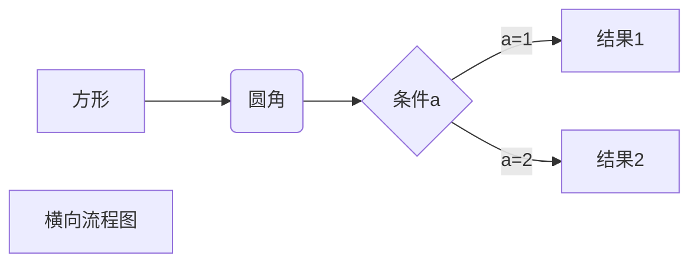
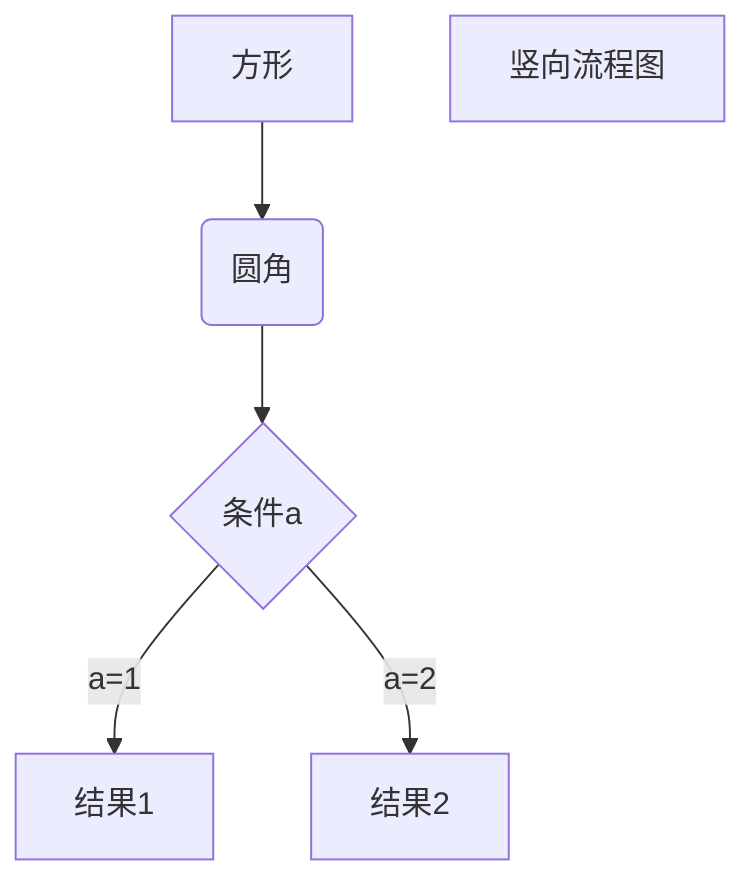

一级标题
=====================

二级标题
---------------------

# 一级标题

## 二级标题

### 三级标题

#### 四级标题

##### 五级标题

###### 六级标题

今天天气是阴天

出门带雨伞，使用空行来换行

*斜体文本*

**粗体文本**

***粗斜体文本***
***************************
分割线

~~删除线~~

无序列表使用星号*、加号+、减号-作为列表标记，标记后面要添加一个空格

* 第一项
+ 第二项
- 第三项

1. 第一项，有序列表：
    - 列表嵌套只需在子列表中的选项前面添加四个空格
2. 第二项
    - 列表嵌套
3. 第三项
    - 第一项嵌套的第二个元素

> 区块

> 菜鸟教程

> 学的不仅是技术更是梦想

> 最外层(区块嵌套)
> > 第一层嵌套
> > > 第二层嵌套

> 区块中使用列表
> 1. 第一项
> 2. 第二项
> + 第一项
> + 第二项
> + 第三项

列表中使用区块

* 第一项
    > 菜鸟教程
    > 学的不仅是技术更是梦想
* 第二项

`printf()`函数

代码区块使用 4 个空格或者一个制表符（Tab 键）。

    <?php
    echo 'RUNOOB';
    function test() {
        echo 'test';
    }

```javascript
$(document).ready(function () {
    alert('RUNOOB');
});
```

这是一个链接 [菜鸟教程](https://www.runoob.com)
*******************

高级链接
这个链接用 1 作为网址变量 [Google][1]

这个链接用 runoob 作为网址变量 [Runoob][runoob]

然后在文档的结尾为变量赋值（网址）

  [1]: http://www.google.com/
  [runoob]: http://www.runoob.com/
  
Markdown图片


哈哈哈哈哈哈哈哈


|  表头   | 表头  |
|  ----  | ----  |
| 单元格  | 单元格 |
| 单元格  | 单元格 |

使用 <kbd>Ctrl</kbd>+<kbd>Alt</kbd>+<kbd>Del</kbd> 重启电脑

**文本加粗** 
\*\* 正常显示星号 \*\*

$f(x)=sin(x)+12$

$$\sum_{n=1}^{100} n$$


$$
\begin{Bmatrix}
   a & b \\
   c & d
\end{Bmatrix}
$$
$$
\begin{CD}
   A @>a>> B \\
@VbVV @AAcA \\
   C @= D
\end{CD}
$$

横向流程图源码格式：


竖向流程图源码格式：


标准流程图源码格式：
```flow
st=>start: 开始框
op=>operation: 处理框
cond=>condition: 判断框(是或否?)
sub1=>subroutine: 子流程
io=>inputoutput: 输入输出框
e=>end: 结束框
st->op->cond
cond(yes)->io->e
cond(no)->sub1(right)->op

标准流程图源码格式（横向）：
```flow
st=>start: 开始框
op=>operation: 处理框
cond=>condition: 判断框(是或否?)
sub1=>subroutine: 子流程
io=>inputoutput: 输入输出框
e=>end: 结束框
st(right)->op(right)->cond
cond(yes)->io(bottom)->e
cond(no)->sub1(right)->op
```
